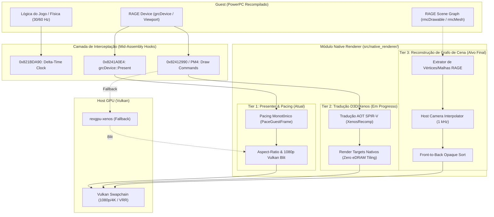
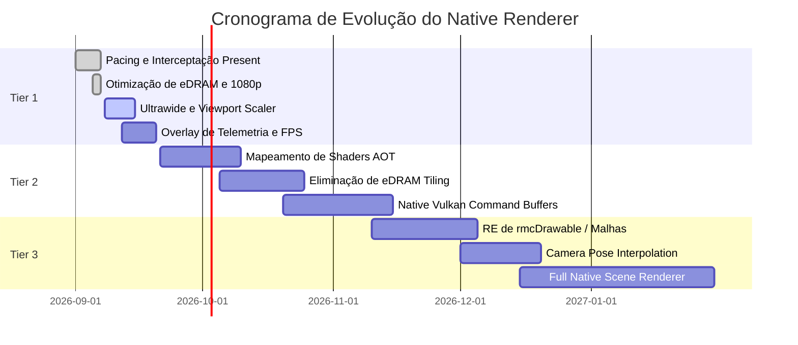

# Midnight Club: Los Angeles — Native Renderer Roadmap

Este documento define a arquitetura, o planejamento estrutural em três níveis (Tiers) e os requisitos pendentes para a substituição gradual da emulação do chip gráfico Xenos por um **Native Renderer Vulkan** de alto desempenho no projeto de recompilação de *Midnight Club: Los Angeles*.

---

## 1. Visão Geral e Arquitetura em Três Níveis

Inspirado nas implementações de referência do ecossistema Xbox 360 Recomp (**Skate3Recomp**, **UnleashedRecomp** e **hells-gate-recomp / Dante's Inferno**), o Native Renderer é dividido em três fases evolutivas:



---

## 2. Estado Atual do Projeto

| Componente | Estado | Detalhes |
| :--- | :--- | :--- |
| **GPU Milestone** | **Tier 2 Ativo** | Promovido no [`AGENTS.md`](../AGENTS.md) com Fragment Shader Interlock e pipeline AOT. |
| **Pacing de Quadros** | **Concluído** | Pacing monotônico de alta precisão (`PaceGuestFrame`) acoplado no relógio do host em `grcDevice::Present`. |
| **Interceptação de Swap** | **Concluído** | Hook determinístico `mcla_native_present_hook` em `0x8241A0E4` (saída gerada `generated/default/midnight_club_la_recomp.68.cpp`, não versionada). |
| **Resolução 1080p** | **Concluído** | Separação de eDRAM e janela host (1080p nativo) sem engasgos de fill-rate. |
| **30 FPS estáveis** | **Concluído** | Hooks experimentais de intro/sombra/60 FPS removidos; pacing no presenter mantém a cadência original sem alterar a simulação. |
| **Fragment Shader Interlock (ROV)** | **Experimental** | Suportado por configuração, mas o caminho FBO é o padrão validado atualmente. |
| **Pipeline Threads & Zero Readback** | **Concluído** | 4 threads de compilação assíncrona paralela e `readback_resolve = "none"`. |
| **Pipeline de Shaders AOT** | **Concluído** | 330 shaders RAGE extraídos e catalogados via [`scripts/catalog_shaders.py`](../scripts/catalog_shaders.py). |

---

## 3. Detalhamento dos Níveis (Tiers)

### Tier 1: Native Presenter & Host Synchronization (Concluído)

O objetivo do Tier 1 é garantir apresentação fluida, ausência de judder, suporte a resoluções arbitrárias e eliminação da latência de double-buffering do console, enquanto os draws ainda passam pelo emulador Xenos.

* [x] **Pacing Monotônico no Relógio do Host**:
  * Implementado em `NativeRenderer::OnGuestPresent` com `sleep_until` e uma janela final curta de *yield/spin*. O smoke test Release de 25 s mediu 29,66 FPS, mediana de 33 ms e p95 de 36 ms.
* [x] **Interceptação de Swap RAGE**:
  * Localizado `sub_82419CB8` e hook em `0x8241A0E4` (`__imp__VdSwap`).
* [x] **Display Scaling 1080p Nativo**:
  * Decoplamento do modo de vídeo guest (720p) e apresentação host (1080p).
* [ ] **Suporte a Ultrawide Dinâmico (21:9 / 32:9)**:
  * Ajustar a matriz de projeção em `grcViewport` para evitar faixas pretas ou esticamento da imagem quando a janela for redimensionada para resoluções ultrawide.
* [ ] **Vulkan HDR / Color Management**:
  * Conversão de gamma linear para sRGB/BT.709 direto no swapchain de apresentação, eliminando o passe de gamma emulada do Xenos.
* [ ] **ImGui Telemetry Overlay**:
  * Painel de depuração em tempo real com gráfico de frame-times (ms), variação de pacing (jitter), e uso de memória de vídeo.

---

### Tier 2: Mid-Level D3D/Xenos Command Translation & Shaders (Em Andamento / Avançado)

O Tier 2 elimina o maior gargalo de desempenho do chip Xenos: a **eDRAM de 10 MB** e os constantes *tile resolves*. Em vez de fatiar telas em múltiplos tiles, os comandos Direct3D do jogo são mapeados diretamente para texturas e pipelines nativos do Vulkan.

* [ ] **Bypass de eDRAM Tiling via Fragment Shader Interlock (ROV)**:
  * Disponível como opção (`render_target_path_vulkan = "fsi"` e `mcla_use_fsi = true`), ainda pendente de validação visual e de estabilidade em gameplay. O padrão atual permanece FBO.
  * Utiliza a extensão `VK_EXT_fragment_shader_interlock` nativa da GPU (AMD Radeon RX 7600 RADV NAVI33), eliminando cópias intermediárias e trocas de layout de render target no Vulkan.
* [x] **Zero Readback Stalls**:
  * Configurado `readback_resolve = "none"` e `vulkan_readback_resolve = false`, mantendo a fila gráfica do host assíncrona sem travar a CPU guest.
* [x] **Multi-threaded Pipeline Creation**:
  * Configurado `vulkan_pipeline_creation_threads = 4` com compilação assíncrona contínua.
* [x] **Extração e Catalogação de Microcode de Shaders RAGE**:
  * Implementado hook e runtime dumping em `shaders_dump/`.
  * Extraídos **330 shaders únicos** (179 vertex, 151 pixel/fragment).
  * Criado o utilitário [`scripts/catalog_shaders.py`](../scripts/catalog_shaders.py) com análise de instruções ALU, vfetch, tfetch, registradores GPR e buffers de constantes.
* [ ] **Tradução Ahead-of-Time (AOT) para SPIR-V Pré-compilado**:
  * Converter os 330 shaders extraídos em módulos SPIR-V embarcados no binário do executável para eliminar 100% dos micro-stutters de compilação em tempo de execução.
* [ ] **Substituição de Comandos PM4 por Vulkan Command Buffers Nativos**:
  * Interceptar draws em `0x82412990` e submeter diretamente ao `VkCommandBuffer`.

---

### Tier 3: High-Level Scene Graph Reconstruction (Fase Avançada)

O Tier 3 segue a abordagem do *Skate3Recomp*: fazer engenharia reversa das estruturas de alto nível do motor RAGE para extrair diretamente vértices, índices e matrizes, desenhando o mundo de jogo com shaders nativos modernos.

```text
RAGE Scene Graph (rmcDrawable)
       │
       ├── Extrator de Malhas (Posição, Normal, UV, Pesos de Skin)
       ├── Amostrador de Câmera 1 kHz (Interpolação Suave de Poses)
       ├── Ordenador de Oclusão (Front-to-Back Early-Z)
       └── Submissão Direta em Command Buffer Vulkan
```

#### O que falta implementar:
1. **Engenharia Reversa das Estruturas RAGE (`rmcDrawable` / `rmcMesh`)**:
   * Localizar as funções de envio de malhas no executável:
     * `rmcDrawable::Draw`
     * `rmcMesh::Render`
     * Declarações de vértices de veículos e cenário urbano.
2. **Decodificação Assíncrona de Malhas (Prewarm Workers)**:
   * Background workers para converter buffers de vértices big-endian do Xbox 360 para formatos nativos do Vulkan (`VK_FORMAT_R32G32B32_SFLOAT`, etc.) sem bloquear a thread de renderização.
3. **Interpolação de Câmera e Entidades a 1 kHz**:
   * O motor de física e câmera do MCLA atualiza em frequência fixa (~30–60 Hz). Em monitores de 144 Hz, 240 Hz ou VRR, isso causa judder na rotação de câmera.
   * Amostrar as matrizes de câmera em alta frequência e interpolá-las com base no timestamp do monitor, gerando movimento perfeitamente fluido.
4. **Supressão de Draws Emulados (`native_render_suppress_emulated_draws`)**:
   * Uma vez que os objetos do cenário sejam renderizados pelo pipeline nativo, desativar os draws correspondentes no emulador Xenos para economizar ciclos de GPU.

---

## 4. Plano de Ação Imediato (Work Packages)



### Próximas Tarefas Prioritárias:

1. **Ajuste de FOV e Ultrawide no `grcViewport`**:
   * Encontrar o cálculo da matriz de projeção em `sub_824112C8` ou rotinas adjacentes e adicionar suporte a 21:9 e 32:9.
2. **Integração de Overlay ImGui com Métricas de Pacing**:
   * Exibir na tela a taxa real de quadros do guest, taxa de apresentação do host e tempo de frame em microssegundos para validar o pacer sob carga pesada.
3. **Início da Catalogação de Shaders RAGE para o Tier 2**:
   * Utilizar as flags de depuração do ReXGlue para despejar os shaders consumidos pela cena da cidade e iniciar o mapeamento para SPIR-V nativo.
