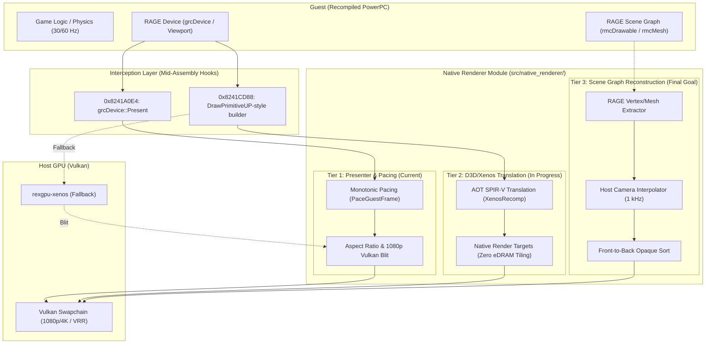
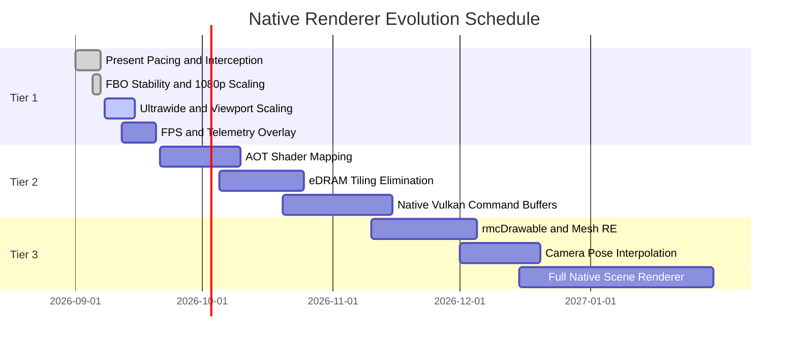

# Midnight Club: Los Angeles — Native Renderer Roadmap

This document defines the architecture, three-tier implementation plan, and
remaining requirements for gradually replacing Xenos graphics emulation with a
high-performance **native Vulkan renderer** in the *Midnight Club: Los Angeles*
recompilation project.

---

## 1. Overview and Three-Tier Architecture

Inspired by reference implementations in the Xbox 360 recompilation ecosystem
(**Skate3Recomp**, **UnleashedRecomp**, and **hells-gate-recomp / Dante's
Inferno**), the native renderer is divided into three evolutionary stages:



---

## 2. Current Project Status

| Component | Status | Details |
| :--- | :--- | :--- |
| **GPU Milestone** | **Tier 2 Capture Active** | The first DrawPrimitiveUP-style path publishes typed records and frame-owned vertex bytes while Xenos remains the renderer. |
| **Final Draw-State Trace** | **Complete** | A bounded SDK trace records final state plus SDK-resolved texture/sampler resources and blend state. Three measured PM4 frames reproduced the dominant pass at exactly 1,625 draws per frame. |
| **Dominant Strip CPU Batch** | **Complete** | A default-off compare path decodes `k8in32` vertices and converts 1,625 independent strips into 6,500 vertices and 9,750 ordered indices without submitting GPU work. |
| **Texture Provenance** | **Complete for intro pass** | `0x1BB40000..0x1BB4FFFF` is CPU-uploaded with no observed GPU writes. It is stable during the intro pass, then dynamically reused by CPU updates. |
| **Late Quad Boundary** | **Complete** | `0x8241D230` accounts for 100% of the logical dominant quad-list pass in two bounded correlations. Xenos replays every logical draw across two vertical eDRAM windows. |
| **Frame Pacing** | **Complete** | High-precision monotonic pacing attached to the host clock at `grcDevice::Present`. |
| **Swap Interception** | **Complete** | Deterministic `mcla_native_present_hook` at `0x8241A0E4` (generated output `generated/default/midnight_club_la_recomp.68.cpp`, not tracked). |
| **1080p Presentation** | **Complete** | Guest eDRAM remains at 720p while the host window presents at 1080p. |
| **Stable 30 FPS** | **Complete** | Experimental intro, shadow, and 60 FPS hooks were removed; presenter pacing preserves stock cadence without modifying guest simulation. |
| **Fragment Shader Interlock (ROV)** | **Experimental** | Available through configuration, while FBO remains the currently validated default. |
| **Pipeline Workers & Zero Readback** | **Complete** | Four asynchronous compilation workers and `readback_resolve = "none"`. |
| **Shader Capture Pipeline** | **Complete** | 330 RAGE shaders were extracted and cataloged with [`scripts/catalog_shaders.py`](../scripts/catalog_shaders.py); native AOT replacement remains future work. |

---

## 3. Tier Details

### Tier 1: Native Presenter and Host Synchronization — Complete

Tier 1 aims to provide smooth presentation, arbitrary display resolutions, and
reduced console-era buffering latency while draws still pass through the Xenos
emulation plugin.

- [x] **Monotonic Host-Clock Pacing**
  - Implemented in `NativeRenderer::OnGuestPresent` with `sleep_until` and a
    short final yield/spin window. A 25-second Release smoke test measured 29.66
    FPS, a 33 ms median, and a 36 ms p95 interval.
- [x] **RAGE Swap Interception**
  - Located `sub_82419CB8` and hooked `0x8241A0E4` immediately before
    `__imp__VdSwap`.
- [x] **Native 1080p Display Scaling**
  - Decouples the 720p guest video mode from 1080p host presentation.
- [ ] **Dynamic Ultrawide Support (21:9 / 32:9)**
  - Adjust the `grcViewport` projection matrix to prevent letterboxing or image
    stretching when resizing to ultrawide resolutions.
- [ ] **Vulkan HDR / Color Management**
  - Convert linear gamma to sRGB/BT.709 in the presentation swapchain and avoid
    the emulated Xenos gamma pass where correctness permits.
- [ ] **ImGui Telemetry Overlay**
  - Display frame-time graphs, pacing jitter, and video-memory usage in real
    time.

---

### Tier 2: Mid-Level D3D/Xenos Command Translation and Shaders — Advanced Work in Progress

Tier 2 targets the major Xenos bottleneck: the 10 MB eDRAM and repeated tile
resolves. Rather than repeatedly splitting the image into tiles, guest Direct3D
commands can eventually map to native Vulkan textures and pipelines.

- [ ] **eDRAM Tiling Bypass through Fragment Shader Interlock (ROV)**
  - Available as an opt-in mode through `render_target_path_vulkan = "fsi"` and
    `mcla_use_fsi = true`, but still requires visual and gameplay stability
    validation. FBO remains the default.
  - Uses `VK_EXT_fragment_shader_interlock` when supported by the GPU. The
    current AMD Radeon RX 7600 RADV/NAVI33 test system exposes the extension.
- [x] **Zero Readback Stalls**
  - Uses `readback_resolve = "none"` and `vulkan_readback_resolve = false` to
    keep the host graphics queue asynchronous in the validated path.
- [x] **Multithreaded Pipeline Creation**
  - Uses four Vulkan pipeline workers with continuous asynchronous compilation.
- [x] **RAGE Shader Microcode Extraction and Cataloging**
  - Added runtime shader dumping to `shaders_dump/`.
  - Extracted 330 unique shaders: 179 vertex and 151 pixel/fragment shaders.
  - Added [`scripts/catalog_shaders.py`](../scripts/catalog_shaders.py) to
    summarize ALU instructions, vertex and texture fetches, GPRs, and constant
    buffers.
- [ ] **Ahead-of-Time Translation to Precompiled SPIR-V**
  - Convert the captured shaders into validated native SPIR-V modules and make
    them available without runtime translation to reduce compilation stutter.
- [ ] **Replace PM4 Commands with Native Vulkan Command Buffers**
  - `0x82412990` was rejected: it emits a wait/flush sequence and blocks until
    the device field at `+0x2B00` becomes zero; it is not a draw boundary.
  - `sub_82427898` is the first proven draw boundary for the target executable.
    It emits `0xC0003600` (`PM4_DRAW_INDX_2`) plus a word derived from `r4` and
    `r5`, then advances the command-buffer pointer at device offset `+0x30`.
  - The observation-only hook publishes immutable per-frame draw snapshots.
    Native command recording and emulated draw suppression remain disabled
    until the packet arguments, surrounding render state, and output parity are
    proven.
  - Runtime selection identified `0x8241CD88`, `0x8241D230`, and `0x8241D620`
    as active logical draw entry points. A Linux/Vulkan smoke test captured up
    to 1,628 records per frame with zero drops while preserving 30 FPS.
  - `0x8241CD88` is now a proven DrawPrimitiveUP-style contract: `r4` is the
    primitive, `r5` is the vertex count, and `r6` is the byte stride. A hook at
    `0x8241D204` observes the returned guest allocation, and Present copies the
    completed bytes into a bounded immutable frame slab.
  - `patches/rexglue-draw-state-trace.patch` captures final command-processor
    state without suppressing draws. In the first bounded PM4 frame, one
    four-vertex auto-indexed triangle-strip signature represented 1,625 of
    1,654 draws (98.2%). All 1,625 draws share shaders, texture, VS constants,
    render targets, and layout; only their 144-byte vertex addresses vary.
  - The first correlated scene frame contained 1,625 strips and three
    six-vertex lists from the same shader pair. The project captured all 1,628
    returned buffers, exactly 234,648 bytes, with zero missing, dropped, or
    unmatched records. It is the current narrow-pass candidate.
  - The compare-only CPU batch accepts exactly those 1,625 four-vertex strips,
    decodes their 9-dword layout, and emits independent triangle-list indices.
    The three six-vertex lists remain unsupported by design. Unit and runtime
    checks reject cross-strip topology, missing data, and non-finite vertices.
  - A three-frame resource capture resolved the dominant pass to one tiled
    256x256 DXT3 texture at physical `0x1BB40000` (64 KiB), linear/repeat
    sampling, standard source-alpha blending, alpha-not-zero testing, and
    reversed greater-equal depth test/write into a 1280-pixel RGBA8 target.
    Descriptor stability is proven; texture-content coherence is not.
  - A physical-range provenance trace subsequently proved the intro texture is
    CPU-authored and directly uploadable without GPU readback. A late capture
    found no reference to that range and no 1,625-strip signature, so this pass
    is retained as an implementation prototype rather than a gameplay FPS
    target.
  - PM4 frames 900..902 contained 19,512 draws. Auto-indexed quad lists using
    `VS 0x4D181C0D99016B72` / `PS 0xEEFF113E5FD82321` contributed 44.7%, and
    indexed triangle lists using `VS 0x3B5E093D268B22F5` /
    `PS 0x93307A3906A73EF9` contributed 36.4%. The narrower quad-list pass is the
    next active-scene correlation target.
  - The project-owned bounded RAGE trace promoted `0x8241D230`: `r4` is the
    primitive type and `r6` is the auto-indexed count. In a three-frame
    correlation it produced 254 quad-list records, exactly matching the 254
    logical target draws after collapsing the 508 PM4 rows into two vertical
    eDRAM tile replays. A second 30-Present window repeated 159/159 logical
    matches with 100% candidate precision and zero frame offset.
  - Both PM4 halves preserve the complete shader, resource, constant, and draw
    sequence. Only `PA_SC_WINDOW_OFFSET`, `PA_SC_WINDOW_SCISSOR_TL`, and
    `PA_SC_WINDOW_SCISSOR_BR` differ: the first window covers rows 0..511 and
    the second covers rows 512..719. Native migration must count logical draws,
    not the replayed PM4 total.

---

### Tier 3: High-Level Scene Graph Reconstruction — Future Phase

Tier 3 follows the *Skate3Recomp* approach: reverse engineer high-level RAGE
structures, extract vertices, indices, and matrices, and render the game world
with native pipelines.

```text
RAGE Scene Graph (rmcDrawable)
       │
       ├── Mesh Extractor (Position, Normal, UV, Skin Weights)
       ├── 1 kHz Camera Sampler (Smooth Pose Interpolation)
       ├── Occlusion Sorter (Front-to-Back Early-Z)
       └── Direct Vulkan Command Buffer Submission
```

#### Remaining work

1. **Reverse Engineer RAGE Structures (`rmcDrawable` / `rmcMesh`)**
   - Locate and prove mesh-submission functions in the executable, including
     candidates for `rmcDrawable::Draw`, `rmcMesh::Render`, and vehicle/city
     vertex declarations.
2. **Asynchronous Mesh Decoding (Prewarm Workers)**
   - Convert big-endian Xbox 360 vertex buffers into native Vulkan formats such
     as `VK_FORMAT_R32G32B32_SFLOAT` without blocking the render thread.
3. **1 kHz Camera and Entity Interpolation**
   - The MCLA camera and physics simulation update at a fixed cadence. High
     refresh-rate and VRR displays require measured pose interpolation to avoid
     camera judder without changing simulation speed.
4. **Emulated Draw Suppression (`native_render_suppress_emulated_draws`)**
   - Disable only the emulated draws already replaced by validated native
     equivalents, avoiding duplicate GPU work and conflicting clears.

---

## 4. Immediate Work Packages



### Next Priorities

1. **Capture the quad-list vertex/resource contract**
   - At `0x8241D230`, associate each logical draw with vertex fetch 95, shader
     constants, and texture descriptors at a coherent boundary. Prove the
     32-byte vertex layout and resource lifetimes before copying data.
2. **Build a compare-only CPU batch for the quad-list pass**
   - Preserve logical draw order and per-material resources, and collapse the
     two eDRAM tile replays. Do not generalize the intro strip batch to this
     different topology or lifetime contract.
3. **Repeat in a deterministic gameplay route**
   - Confirm the boundary coverage, tile factor, and resource layout outside
     the automatic active scene before making FPS claims.
4. **Submit a proven batch to an offscreen Vulkan comparison target**
   - Upload native vertices, indices, and CPU-authored textures without touching
     the displayed Xenos framebuffer.
5. **Validate gameplay and image parity**
   - Repeat the correlation in a controlled gameplay scene, image-compare the
     native pass, retain Xenos for every unknown operation, and suppress an
     emulated draw only after parity and fallback recovery are validated.
