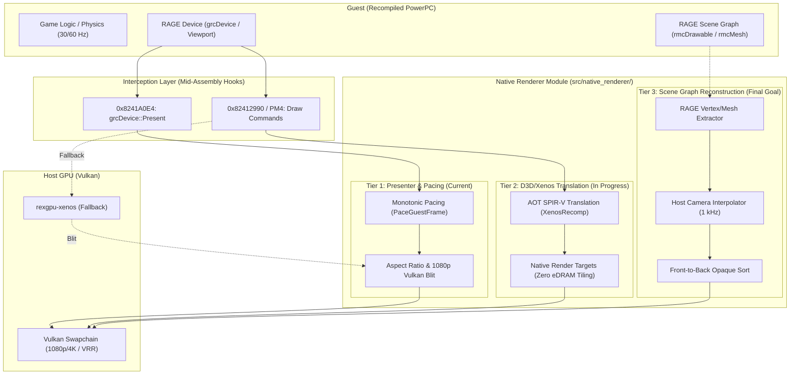
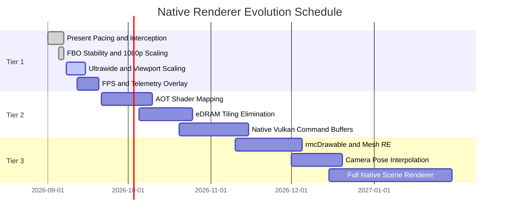

# Midnight Club: Los Angeles — Native Renderer Roadmap

This document defines the architecture, three-tier implementation plan, and
remaining requirements for gradually replacing Xenos graphics emulation with a
high-performance **native Vulkan renderer** in the *Midnight Club: Los Angeles*
recompilation project.

---

## 1. Overview and Three-Tier Architecture

Inspired by reference implementations in the Xbox 360 recompilation ecosystem
(**Skate3Recomp**, **UnleashedRecomp**, and **hells-gate-recomp / Dante's
Inferno**), the native renderer is divided into three evolutionary stages:



---

## 2. Current Project Status

| Component | Status | Details |
| :--- | :--- | :--- |
| **GPU Milestone** | **Tier 2 Active** | Established in [`AGENTS.md`](../AGENTS.md), with Fragment Shader Interlock and an AOT pipeline as ongoing targets. |
| **Frame Pacing** | **Complete** | High-precision monotonic pacing attached to the host clock at `grcDevice::Present`. |
| **Swap Interception** | **Complete** | Deterministic `mcla_native_present_hook` at `0x8241A0E4` (generated output `generated/default/midnight_club_la_recomp.68.cpp`, not tracked). |
| **1080p Presentation** | **Complete** | Guest eDRAM remains at 720p while the host window presents at 1080p. |
| **Stable 30 FPS** | **Complete** | Experimental intro, shadow, and 60 FPS hooks were removed; presenter pacing preserves stock cadence without modifying guest simulation. |
| **Fragment Shader Interlock (ROV)** | **Experimental** | Available through configuration, while FBO remains the currently validated default. |
| **Pipeline Workers & Zero Readback** | **Complete** | Four asynchronous compilation workers and `readback_resolve = "none"`. |
| **Shader Capture Pipeline** | **Complete** | 330 RAGE shaders were extracted and cataloged with [`scripts/catalog_shaders.py`](../scripts/catalog_shaders.py); native AOT replacement remains future work. |

---

## 3. Tier Details

### Tier 1: Native Presenter and Host Synchronization — Complete

Tier 1 aims to provide smooth presentation, arbitrary display resolutions, and
reduced console-era buffering latency while draws still pass through the Xenos
emulation plugin.

- [x] **Monotonic Host-Clock Pacing**
  - Implemented in `NativeRenderer::OnGuestPresent` with `sleep_until` and a
    short final yield/spin window. A 25-second Release smoke test measured 29.66
    FPS, a 33 ms median, and a 36 ms p95 interval.
- [x] **RAGE Swap Interception**
  - Located `sub_82419CB8` and hooked `0x8241A0E4` immediately before
    `__imp__VdSwap`.
- [x] **Native 1080p Display Scaling**
  - Decouples the 720p guest video mode from 1080p host presentation.
- [ ] **Dynamic Ultrawide Support (21:9 / 32:9)**
  - Adjust the `grcViewport` projection matrix to prevent letterboxing or image
    stretching when resizing to ultrawide resolutions.
- [ ] **Vulkan HDR / Color Management**
  - Convert linear gamma to sRGB/BT.709 in the presentation swapchain and avoid
    the emulated Xenos gamma pass where correctness permits.
- [ ] **ImGui Telemetry Overlay**
  - Display frame-time graphs, pacing jitter, and video-memory usage in real
    time.

---

### Tier 2: Mid-Level D3D/Xenos Command Translation and Shaders — Advanced Work in Progress

Tier 2 targets the major Xenos bottleneck: the 10 MB eDRAM and repeated tile
resolves. Rather than repeatedly splitting the image into tiles, guest Direct3D
commands can eventually map to native Vulkan textures and pipelines.

- [ ] **eDRAM Tiling Bypass through Fragment Shader Interlock (ROV)**
  - Available as an opt-in mode through `render_target_path_vulkan = "fsi"` and
    `mcla_use_fsi = true`, but still requires visual and gameplay stability
    validation. FBO remains the default.
  - Uses `VK_EXT_fragment_shader_interlock` when supported by the GPU. The
    current AMD Radeon RX 7600 RADV/NAVI33 test system exposes the extension.
- [x] **Zero Readback Stalls**
  - Uses `readback_resolve = "none"` and `vulkan_readback_resolve = false` to
    keep the host graphics queue asynchronous in the validated path.
- [x] **Multithreaded Pipeline Creation**
  - Uses four Vulkan pipeline workers with continuous asynchronous compilation.
- [x] **RAGE Shader Microcode Extraction and Cataloging**
  - Added runtime shader dumping to `shaders_dump/`.
  - Extracted 330 unique shaders: 179 vertex and 151 pixel/fragment shaders.
  - Added [`scripts/catalog_shaders.py`](../scripts/catalog_shaders.py) to
    summarize ALU instructions, vertex and texture fetches, GPRs, and constant
    buffers.
- [ ] **Ahead-of-Time Translation to Precompiled SPIR-V**
  - Convert the captured shaders into validated native SPIR-V modules and make
    them available without runtime translation to reduce compilation stutter.
- [ ] **Replace PM4 Commands with Native Vulkan Command Buffers**
  - Intercept the relevant draw path near `0x82412990` only after its calling
    convention and revision stability are proven, then submit equivalent work
    to a native `VkCommandBuffer`.

---

### Tier 3: High-Level Scene Graph Reconstruction — Future Phase

Tier 3 follows the *Skate3Recomp* approach: reverse engineer high-level RAGE
structures, extract vertices, indices, and matrices, and render the game world
with native pipelines.

```text
RAGE Scene Graph (rmcDrawable)
       │
       ├── Mesh Extractor (Position, Normal, UV, Skin Weights)
       ├── 1 kHz Camera Sampler (Smooth Pose Interpolation)
       ├── Occlusion Sorter (Front-to-Back Early-Z)
       └── Direct Vulkan Command Buffer Submission
```

#### Remaining work

1. **Reverse Engineer RAGE Structures (`rmcDrawable` / `rmcMesh`)**
   - Locate and prove mesh-submission functions in the executable, including
     candidates for `rmcDrawable::Draw`, `rmcMesh::Render`, and vehicle/city
     vertex declarations.
2. **Asynchronous Mesh Decoding (Prewarm Workers)**
   - Convert big-endian Xbox 360 vertex buffers into native Vulkan formats such
     as `VK_FORMAT_R32G32B32_SFLOAT` without blocking the render thread.
3. **1 kHz Camera and Entity Interpolation**
   - The MCLA camera and physics simulation update at a fixed cadence. High
     refresh-rate and VRR displays require measured pose interpolation to avoid
     camera judder without changing simulation speed.
4. **Emulated Draw Suppression (`native_render_suppress_emulated_draws`)**
   - Disable only the emulated draws already replaced by validated native
     equivalents, avoiding duplicate GPU work and conflicting clears.

---

## 4. Immediate Work Packages



### Next Priorities

1. **FOV and Ultrawide Support in `grcViewport`**
   - Locate the projection-matrix calculation near `sub_824112C8` or adjacent
     routines and prove the data flow before adding 21:9 and 32:9 support.
2. **ImGui Pacing Telemetry**
   - Display guest update rate, host presentation rate, and frame time in
     microseconds so pacing can be validated under heavy load.
3. **Gameplay Shader and Pipeline Coverage**
   - Capture a deterministic city/race segment, catalog newly encountered
     shaders, and measure cold-versus-warm pipeline behavior before designing
     native AOT replacement.
